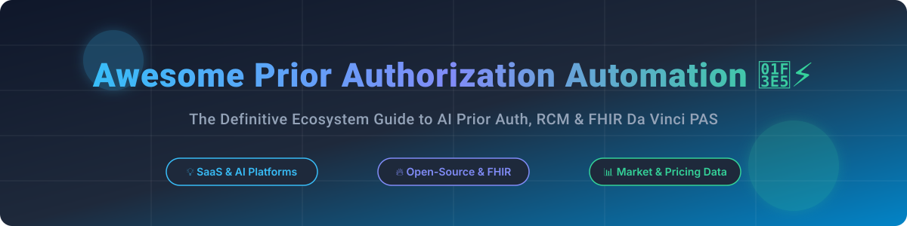

# Awesome Prior Authorization Automation 🏥⚡



<a href="https://github.com/ishandutta2007/Awesome-Awesome-Awesome"></a><a href="https://discord.gg/jc4xtF58Ve"></a>
[](https://github.com/ishandutta2007/Awesome-Awesome-Awesome)
[](http://makeapullrequest.com)
[](LICENSE)
<a href="https://github.com/ishandutta2007"></a>

> A curated ecosystem guide to **AI-Powered Prior Authorization Automation**, **Revenue Cycle Management (RCM)**, **Medical Necessity Intelligence**, and **Open-Source FHIR Standards (Da Vinci PAS)**.

---

## 📑 Table of Contents
- [📊 Market Overview & Sector Insights](#-market-overview--sector-insights)
- [🏢 SaaS & Commercial Platforms](#-saas--commercial-platforms)
- [🔓 Open-Source GitHub Projects](#-open-source-github-projects)
- [💡 Implementation Architecture](#-implementation-architecture)
- [🤝 How to Contribute](#-how-to-contribute)
- [💖 Support & Sponsorship](#-support--sponsorship)
- [📈 Star History](#-star-history)
- [⚠️ Disclaimer](#%EF%B8%8F-disclaimer)

---

## 📊 Market Overview & Sector Insights

The U.S. Healthcare Prior Authorization Automation sector represents an estimated **$7.5 Billion TAM (Total Addressable Market)** as of 2026, driven by CMS interoperability mandates (CMS-0057-F) requiring API-based prior authorization for Medicare Advantage, Medicaid, and CHIP plans.

The market is currently **moderately fragmented**, undergoing rapid consolidation:
- **Legacy Clearinghouses & Networks** (e.g., Availity, Surescripts, Waystar) dominate transactional volume and portal integrations.
- **AI-Native & Clinical Intelligence Scale-ups** (e.g., Cohere Health, AKASA, Infinitus AI) capture high-value clinical packet assembly and medical necessity determination.
- **Enterprise EHR & Content Automation** vendors (e.g., Hyland) embed authorization workflows directly into health system document streams.

---

## 🏢 SaaS & Commercial Platforms

Below is a comparison of top SaaS platforms handling Prior Authorization, RCM, and clinical necessity determination, sorted by company size (valuation / annual revenue, descending).

| Platform 🏢 | Valuation / Revenue 📈 | Description 📝 | Specific Pricing 💵 | Free Tier / Trial Limit ⏱️ |
| :--- | :--- | :--- | :--- | :--- |
| **[Waystar](https://www.waystar.com/)** | **$3.8B** Valuation ($1.04B TTM Rev) | Comprehensive enterprise RCM platform with automated prior authorization submission and real-time status tracking. | Enterprise tier starting at **$450/month per practice** (or base per-provider monthly subscription). | 14-day guided enterprise sandbox demo; no permanent free tier. |
| **[Cohere Health](https://coherehealth.com/)** | **$1.2B** Valuation ($100M+ ARR) | Clinical intelligence platform automating medical necessity reviews and prior auth decisions for over 20M patients. | Provider access free (payer funded); Enterprise Payer integration starts at **$120,000/year base platform fee**. | Permanent free web portal access for participating provider networks; no credit card required. |
| **[Availity](https://www.availity.com/)** | **$1.0B+** Valuation ($400M+ Est. Rev) | Nation's largest real-time health information network connecting providers with 2,000+ commercial and government payers. | Essentials Pro tier starting at **$99/month per provider** (plus standard EDI transaction volume fees). | Availity Essentials Free Tier available for basic single-payer portal eligibility & auth status queries. |
| **[Surescripts](https://surescripts.com/)** | **$800M+** Est. Valuation ($350M+ Rev) | Leading national e-prescribing network supporting Electronic Prior Authorization (ePA) for medication workflows. | EHR vendor integrated licensing starting at **$0.15 per electronic authorization transaction**. | 30-day developer sandbox access for EHR developers with sample test patient records. |
| **[Hyland Healthcare](https://www.hyland.com/)** | **$750M+** Annual Revenue | Enterprise content management & clinical document automation connecting unstructured records into prior auth packets. | On-premise / cloud enterprise deployment starting at **$25,000 upfront + $5,000/year maintenance**. | 30-day trial for OnBase clinical document classification modules. |
| **[AKASA](https://www.akasa.com/)** | **$500M+** Valuation ($50M+ Est. Rev) | AI-first revenue cycle automation platform using Generative AI and RPA for end-to-end authorization workflows. | Annual contract starting at **$50,000/year** based on claims & authorization volume. | 30-day proof-of-concept (PoC) pilot for qualified health systems. |
| **[Olive AI](https://oliveai.com/)** | **$400M** Asset Valuation | Healthcare process automation platform addressing prior auth routing and portal data extraction. | Custom enterprise implementation packages starting at **$35,000/year per module**. | 14-day proof-of-concept Sandbox trial. |
| **[Infinitus AI](https://www.infinitus.ai/)** | **$350M** Valuation ($25M+ Est. Rev) | Voice AI agent platform automating phone call inquiries for benefit verification and prior authorization status. | Pay-per-call automation starting at **$4.50 per automated payer call**. | 100 free AI automated payer call credits for initial onboarding verification. |
| **[Ribbon Health](https://www.ribbonhealth.com/)** | **$200M+** Valuation ($15M+ Est. Rev) | Provider data platform delivering accurate insurance network coverage and prior auth requirement verification APIs. | API access starting at **$500/month** (includes up to 50,000 API queries/month). | 30-day free developer sandbox with 1,000 API test requests. |
| **[Humata Health](https://www.humatahealth.com/)** | **$100M+** Valuation ($10M+ Est. Rev) | AI engine connecting providers and payers for automated medical review and prior auth approvals. | Provider starter plan at **$299/month per facility**; Payer licenses customized per member count. | 14-day full feature trial for provider clinical teams. |

---

## 🔓 Open-Source GitHub Projects

Explore open-source implementations, FHIR implementation guides, and AI reference architectures. Sorted by GitHub Star Count (descending).

| Project / Repository 📦 | GitHub_Stars ⭐ | Category 🏷️ | Description 📝 |
| :--- | :--- | :--- | :--- |
| **[HL7 Da Vinci PAS IG](https://github.com/HL7/davinci-pas)** | [](https://github.com/HL7/davinci-pas/stargazers) | FHIR Standard | Official HL7 Da Vinci Prior Authorization Support (PAS) Implementation Guide using FHIR resources (Claim, ClaimResponse) and X12 278 translation. |
| **[SMART on FHIR JavaScript Client](https://github.com/smart-on-fhir/client-js)** | [](https://github.com/smart-on-fhir/client-js/stargazers) | FHIR Library | Open-source SMART on FHIR JavaScript client library used to embed prior authorization apps directly within EHR systems (Epic, Cerner). |
| **[HAPI FHIR Core Library](https://github.com/hapifhir/hapi-fhir)** | [](https://github.com/hapifhir/hapi-fhir/stargazers) | FHIR Engine | Open-source Java FHIR framework powering prior authorization data transformation, validation, and Da Vinci profile enforcement. |
| **[Documenso OCR & Data Extraction](https://github.com/documenso/documenso)** | [](https://github.com/documenso/documenso/stargazers) | Document AI | Open document workflow and signing engine adaptable for clinical attachment compilation and authorization packet generation. |
| **[AWS HealthLake Prior Auth Sample](https://github.com/aws-samples/aws-healthlake-medication-prior-auth)** | [](https://github.com/aws-samples/aws-healthlake-medication-prior-auth/stargazers) | Cloud AI Demo | AWS reference implementation demonstrating FHIR HealthLake integration for automated medication prior auth decision support. |
| **[Medplum FHIR Backend](https://github.com/medplum/medplum)** | [](https://github.com/medplum/medplum/stargazers) | FHIR Platform | Open-source headless EHR and developer platform with native FHIR API support for managing prior authorization requests and task workflows. |
| **[Clinical AI Agent Prior Auth Helper](https://github.com/langchain-ai/langchain)** | [](https://github.com/langchain-ai/langchain/stargazers) | LLM Framework | Framework widely used for building experimental LLM agents that parse clinical PDF notes and match against payer coverage guidelines. |
| **[BPMN Workflow Orchestration (Camunda)](https://github.com/camunda/camunda)** | [](https://github.com/camunda/camunda/stargazers) | Workflow Engine | Open process orchestration engine used to build complex multi-step prior auth submission, retry, and human-in-the-loop review flows. |
| **[Open-Source RPA Framework (Robot Framework)](https://github.com/robotframework/robotframework)** | [](https://github.com/robotframework/robotframework/stargazers) | RPA Tool | Generic automation framework used in healthcare RPA experiments to automate web-portal prior auth status retrieval. |
| **[Healthcare Audit & HIPAA Logging Helper](https://github.com/elastic/elasticsearch)** | [](https://github.com/elastic/elasticsearch/stargazers) | Compliance Logging | Open search and analytics engine for maintaining HIPAA-compliant audit trails of prior authorization submissions and decisions. |

---

## 💡 Implementation Architecture

Building custom prior authorization capabilities requires coordinating multiple interoperability layers:

```
[ Clinical EHR (Epic / Cerner) ]
               │
               ▼ (SMART on FHIR / Clinical Notes)
[ Document AI & NLP Extraction Engine ] ──► Extracts Medical Necessity Criteria
               │
               ▼ (Da Vinci PAS Bundle)
[ FHIR Mapping Engine (HAPI / Medplum) ] ──► Converts to X12 278 Transaction
               │
               ▼ (Clearinghouse API / Portal RPA)
[ Payer Endpoint / Availity Clearinghouse ] ──► Receives Real-Time Approval / Denial
```

---

## 🤝 How to Contribute

Contributions are welcome! Help us expand and update this list:
1. Fork this repository.
2. Edit `README.md` following the tabular format and guidelines above.
3. Submit a Pull Request with a short summary of changes.

---

## 💖 Support & Sponsorship

Thank you for visiting and supporting this project! If you find this curated list helpful for your healthcare engineering, revenue cycle, or utilization management workflows, please consider:
- 🌟 **Starring** this repository on GitHub.
- 🔀 **Forking** and sharing with colleagues and open-source contributors.
- ☕ **Buying me a coffee / Sponsoring** the maintainer to support ongoing open-source healthcare research:

<p align="center">
  <a href="https://github.com/sponsors/ishandutta2007">
    
  </a>
</p>

---

## 📈 Star History

[](https://star-history.dera.page/#ishandutta2007/Awesome-Prior-Authorization-Automation&type=date&legend=top-left)

---

## ⚠️ Disclaimer

- This repository is a **community-curated informational list** and does not constitute medical, financial, or legal advice.
- Prior authorization involves **Protected Health Information (PHI)** regulated under HIPAA. Open-source tools require extensive clinical validation, security auditing, and compliance testing prior to production deployment.

---

<p align="center">
  <b>Built for Healthcare Engineers, Revenue Cycle Leaders, and Utilization Management Teams 🏥⚡</b>
</p>
